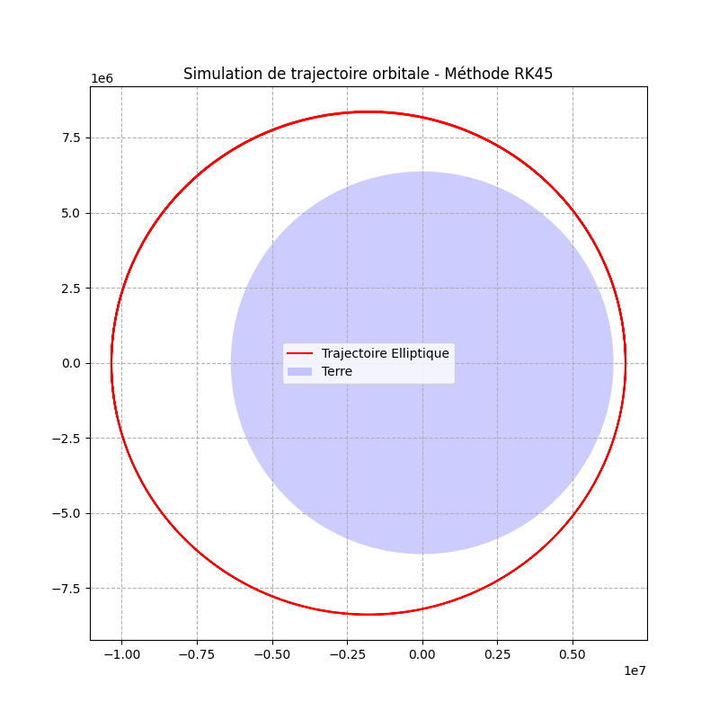
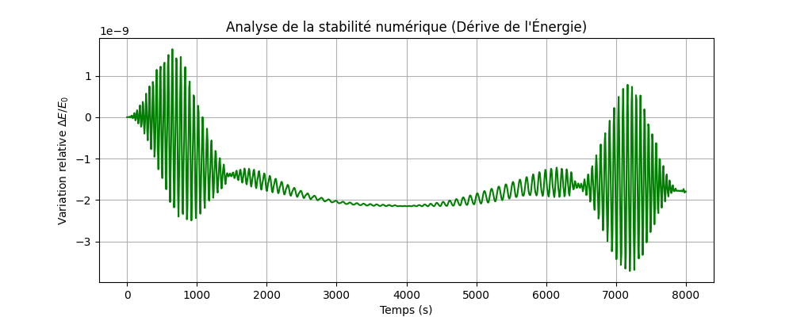
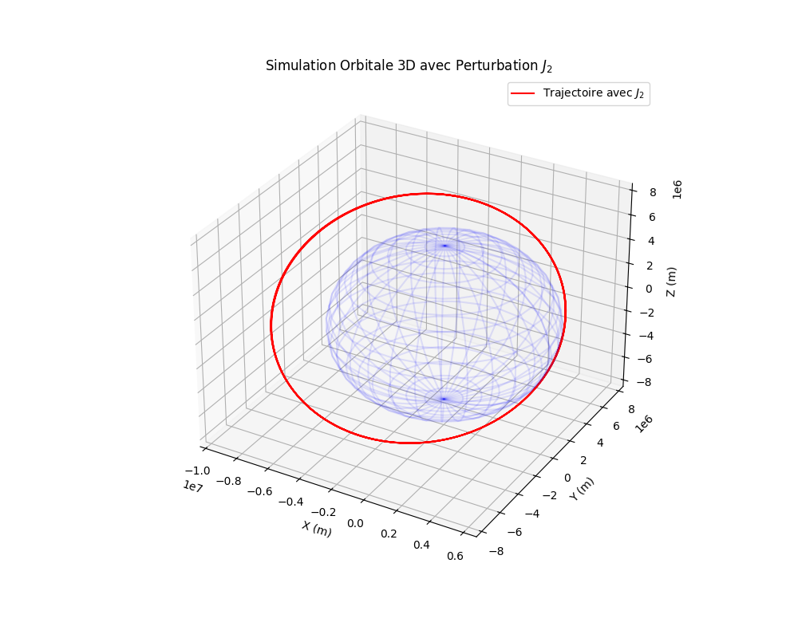
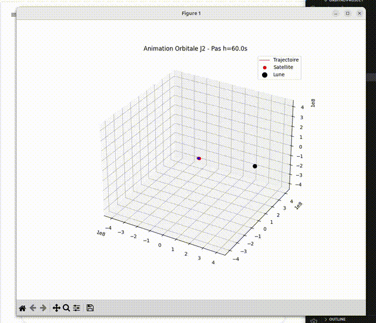

# Orbital Trajectory System
## Overview
This project is developed as a personal research initiative by an Engineering Student at **UCLouvain** (Applied Mathematics & Computer Science). The goal is to simulate and visualize orbital trajectories using Newtonian mechanics and numerical integration methods.

## Objectives
* **Physics:** Implement the 2-body problem and model orbital mechaics.
* **Mathematics:** Solve the **Cauchy Problem** ($y'(t) = f(t, y(t))$) using Runge-Kutta 4th Order (RK45) method.
* **Software:** Build a modular python architecture (Physics / Solver / Main).

## Simulation & Stability Analysis

### 1. Elliptical Orbit (Keplerian Motion)
By increasing the initial orbital velocty by 10%, we transition from a circular to an elliptical orbit. This demonstrates the conservation of angular momentum and the first law of kepler.

### 2. Numerical Stability (Energy conservation)
A key challenge in numerical integration is the accumulation of truncation errors. Following the **Numerical Methods** curriculum, I validated the solver by monitoring the specific mechanincal energy: $$E = \frac{1}{2}v^2 - \frac{\mu}{r}$$

*Observation: The relative energy drift $\Delta E / E_0$ remains below $10^{-10}$,confirming the high precision and stability of the RK45 adaptive step-size integrator.*

## Tech Stack
* **Language:** Python 3.12
* **Libraries:** Numpy, Scipy, Matplotlib
* **Environment:** Linux Ubuntu

### 3. $J_2$ Perturbation & Earth Oblateness
Real-world orbits are not perfect ellipses due to Earth's non_spherical shape. I implemented the $J_2$ perturbation term in the equations of motion to model the effect of the equatorial bulge.

**Key Findings:**
- **Oscillating Keplerian Energy**: The exchange between kinetic energy and the $J_2$ potential field is clearly visible in the energy drift plot.
- **Orbital Precession**: The non-central force causes a nodal regression, rotating the orbital plane over time.

### 3D Multi-Orbit Visualization
The 3D plot below illustrates the orbital inclination and the effect of the $J_2$ perturbation term.
The wireframe sphere represents Earth at scale ($R_e = 6378$ km).

*The simulation confirms yhe nodal regression caused by Earth's oblateness, a key factor in Sun_synchronous orbit design.*

## Final Validation & Conclusion

The simulation was cross-verified by comparing the numerical results with the analytical J2 perturbation theory.

### Key Results
- **Numerical Nodal Precession**: -5.4929e-07 rad/s
- **Theoretical Nodal Precession**: -5.5248e-07 rad/s
- **Final Relative Error**: **0.385 %**

### Engineering Insights
The sub-1% error demonstrates the high fidelity of the **RK45 adaptive step-size integrator**. The minor discrepancy is attributed to the difference between the first-order secular theory (analytical) and the full osculating dynamics captured by the numerical solver. This confirms that the software architecture is reliable for long-term orbital propagation.

## Visualizations
The project features a 3D visualization suite illustrating orbital inclination and nodal regression.

## 3-Body Dynamic Simulation
The animation below shows the concurrent motion of the satellite (LEO) and the Moon. The simulation accounts for the time-dependent gravitational pull of the Moon, creating a complex perturbed environment.

## Final Validation
By integrating the Moon's gravity and Earth's oblateness, the system achieves high  physical fidelity.

## Future Work
* **N-Body Simulation:** Extending the state vector to $6 \times N$ for Solar System dynamics.
* **Galactic Trajectories:** Modeling stellar motion within galactic potentials.
* **Deep Space Missions:** Implementing interplanetary transfer maneuvers (Hohmann).

