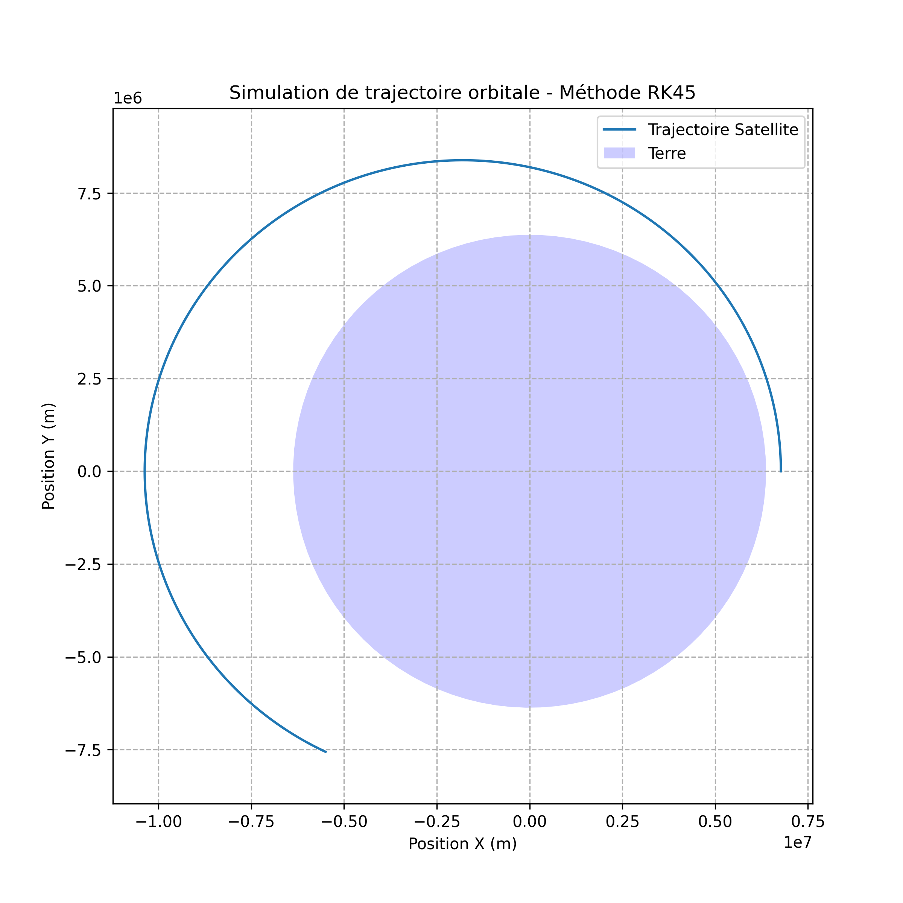

# Orbital Trajectory System
## Overview
This project is devloped as a personal research initiative by an Engineering Student at **UCLouvain** (Applied Mathematics & Computer Science). The goal is to simulate and visualize orbital trajectories using Newtonian mechanics and numerical integration methods.

## Objectives
* **Physics:** Implement the 2-body problem and progress towards $J_2$ pertubations.
* **Mathematics:** Utilize Runge-Kutta 4th Order (RK4) integration for high-precision orbit propagation.
* **Software:** Build a clean, modular python architecture.

## Tech Stack
* **Language:** Python 3.12
* **Libraries:** Numpy, Scipy, Matplotlib
* **Environment:** Linux Ubuntu

I implemented a 4th-oredr Runge-Kutta integrator based on the Numerical Methods curriculum at UCLouvain to ensure energy conservation and trajectory stability in a 2-body simulation.

## Simulation Results
Here is the output of the circular orbit simulation (Altitude: 400km) using the RK45 integrator:

